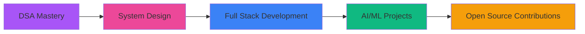

<div align="center">
  
</div>

<h1 align="center">
  
</h1>

<p align="center">
  
</p>

---

## 👨‍💻 About Me

```typescript
const Ankita = {
    location: "Mumbai, India 🇮🇳",
    education: "B.Tech - ITM Skills University",
    currentFocus: ["Data Structures & Algorithms", "AI/ML", "Full Stack Development"],
    interests: ["Artificial Intelligence", "AR/VR", "Problem Solving", "Open Source"],
    lifePhilosophy: "Code. Learn. Innovate. Repeat. 🚀"
};
```


### 🌟 Quick Facts

- 🔭 Currently working on **DSA & Competitive Programming**
- 🌱 Learning **Machine Learning, Data Science & Web Development**
- 💡 Passionate about **AI/ML & AR/VR Technologies**
- 🎯 2026 Goals: **Contribute to Open Source & Build Impactful Projects**
- 📫 Reach me: **2023.ankital@gmail.com**
- ⚡ Fun fact: **I debug with console.log and I'm proud of it!**

<br clear="both">

---

## 🤝 Connect With Me

<p align="center">
  <a href="https://twitter.com/_ankitaaa19" target="_blank">
    
  </a>
  <a href="https://www.linkedin.com/in/ankitalokhande19/" target="_blank">
    
  </a>
  <a href="https://leetcode.com/u/_ankitaaa19/" target="_blank">
    
  </a>
</p>

---

## 🛠️ Technical Skills

### Programming Languages
<p align="left">
  
  
  
  
  
</p>

### Web Development
<p align="left">
  
  
  
  
  
</p>

### Databases
<p align="left">
  
  
</p>

### Tools & Technologies
<p align="left">
  
  
  
  
  
</p>

### AI/ML & Data Science
<p align="left">
  
  
  
  
</p>

---

## 🏆 GitHub Trophies

<p align="center">
  
</p>

---

## 📊 GitHub Statistics

<div align="center">
  
  
</div>

<p align="center">
  
</p>

---

## 🌊 Ocean of Learning - Depth of My Coding Journey

<div align="center">
  
</div>

<table align="center" width="100%">
<tr>
<td width="33%" align="center">
  
  ### 🐠 Swimming Fish
  **Projects & Repos**
  
  
  
  *Each fish represents a project*
  *swimming through the ocean of code*
  
</td>
<td width="33%" align="center">
  
  ### 🪨 Solid Foundations  
  **Core Skills & DSA**
  
  
  
  *Stones at the ocean floor*
  *represent my solid foundation*
  
</td>
<td width="33%" align="center">
  
  ### 🌿 Growing Knowledge
  **Learning & Development**
  
  
  
  *Seaweed and coral growing*
  *as I expand my knowledge*
  
</td>
</tr>
</table>

<div align="center">
  
  
  <h3>🌊 The Deeper I Dive, The More I Discover 🌊</h3>
  
  <p>
    
  </p>
  
  
</div>

---

## 💻 LeetCode Stats

<p align="center">
  
</p>

---

## 🎯 Current Learning Path



---

<div align="center">
  

  ### 💡 "The only way to do great work is to love what you do." - Steve Jobs

  <p>⭐️ From <a href="https://github.com/ankitaa19">Ankita Lokhande</a></p>
</div>
